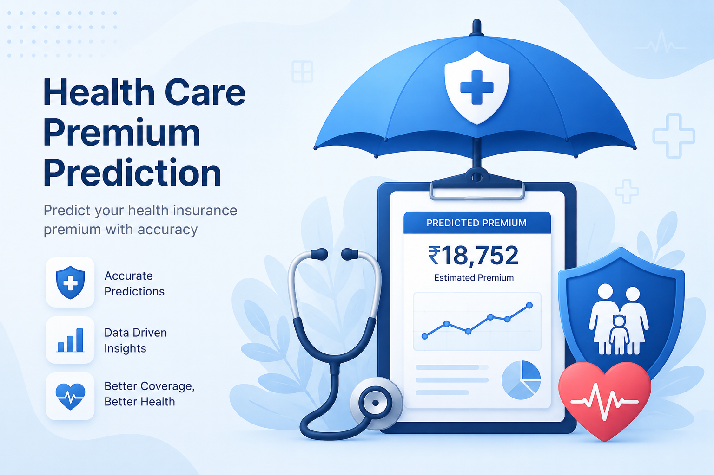

# 🛡️ Insurance Premium Prediction

A machine learning web application built with **Streamlit** that predicts estimated insurance premiums based on customer demographics, health profile, and plan preferences.


---

## 📸 Preview

> Fill in customer details from the sidebar and click **Predict Premium** to get an instant estimate.



---

## ✨ Features

- **Interactive sidebar** with sliders, dropdowns, and number inputs for all customer fields
- **Instant premium prediction** powered by a trained ML model
- **Input summary cards** showing all selected inputs after prediction
- **Clean, responsive UI** with a custom blue header, icon grid, and result card
- **Wide layout** optimized for desktop use

---

## 🧠 Input Features

| Feature | Type | Description |
|---|---|---|
| Age | Slider (18–100) | Customer age |
| Gender | Dropdown | Male / Female |
| Region | Dropdown | Northwest, Southeast, Northeast, Southwest |
| BMI Category | Dropdown | Normal, Overweight, Obesity, Underweight |
| Smoking Status | Dropdown | Non-smoker, Occasional, Regular |
| Medical History | Dropdown | No disease, Diabetes, Heart disease, etc. |
| Annual Income | Number input | USD |
| Insurance Plan | Dropdown | Bronze, Silver, Gold |
| Dependants | Number input | Number of dependants |
| Employment Status | Dropdown | Salaried, Self-Employed, Freelancer |
| Marital Status | Dropdown | Unmarried, Married |
| Genetical Risk | Number input | Score from 0 to 5 |

---

## 🗂️ Project Structure

```
insurance-premium-prediction/
│
├── main.py                  # Streamlit UI — layout, inputs, prediction display
├── prediction_helper.py     # ML model loading and predict() function
├── ml_project_image.png     # Hero section illustration
├── requirements.txt         # Python dependencies
└── README.md
```

---


## 📦 Requirements

```
streamlit
scikit-learn
pandas
numpy
```

Add these to `requirements.txt`. Exact versions depend on your model's training environment.

---

## 🔧 How It Works

1. The user fills in their details in the sidebar
2. On clicking **Predict Premium**, `input_dict` is passed to `predict()` in `prediction_helper.py`
3. The helper preprocesses the inputs (encoding, scaling) and runs inference via the trained model
4. The predicted premium is displayed in the result card along with a full input summary

---

## ⚠️ Disclaimer

> This prediction is based on a machine learning model trained on historical data and **should not be considered actual insurance pricing**. For real premium quotes, consult a licensed insurance provider.

---
